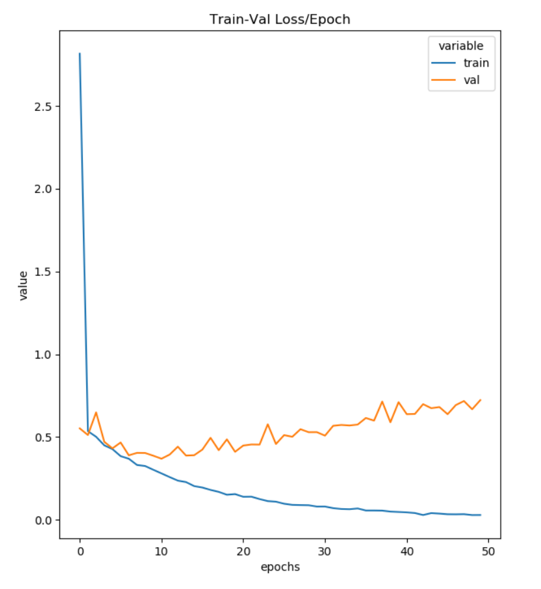
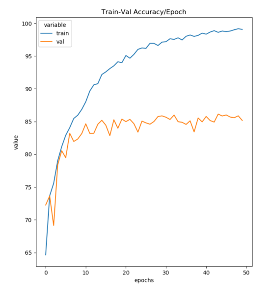
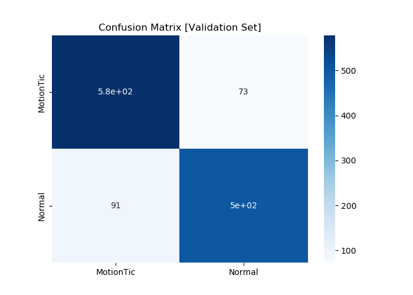
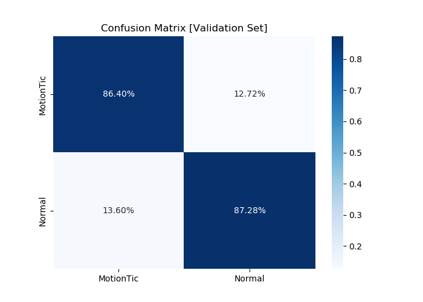

# Motor Tic Detector 

## description
- Pytorh GPU implementation of CNN for Motor-Tic Detection in Movement Disorders
- Eye Tics vs Normal Classification

## code
- All source code is in `src`.
- Train using the `CNN.py` file.
- Get best model using the `TestCNN.py` file.

## documentation
- Code is the documentation of itself.

## usage
- Use `python3 CNN.py` to generate a confusion matrix.
- A summary of the pipeline is given in `report.pdf`.

## demonstration
The pipeline is demonstrated below.

- Training Curves.

| Losses | Accuracies |
| --- | --- |
|  |  |

- Classification Confusion Matrix.

| Absolute Values | Percentages |
| --- | --- |
|  |  |

